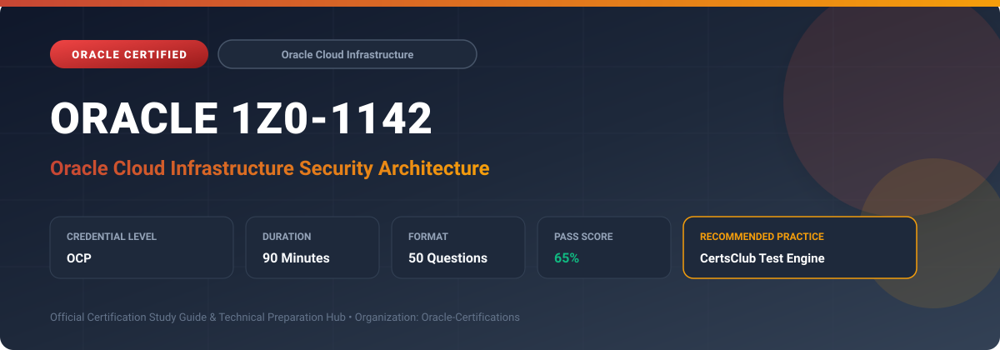

  

# Oracle 1Z0-1142: Oracle Cloud Infrastructure Security Architecture

---

## 1. Exam Overview & Candidate Profile

The **Oracle 1Z0-1142: Oracle Cloud Infrastructure Security Architecture** exam validates security architects designing end-to-end, zero-trust security postures across enterprise cloud workloads on OCI.

Candidates prove their ability to architect multi-layered defense frameworks, IAM Identity Domains, network microsegmentation, cryptographic key governance (OCI Vault/HSM), Cloud Guard, Security Zones, and compliance automation.

### Target Audience & Prerequisites
- **Target Roles**: Implementation Specialists, Cloud Architects, Technical Leads, Enterprise Consultants, and Systems Engineers.
- **Recommended Experience**: 1–2 years of practical, hands-on experience designing, implementing, and maintaining corresponding Oracle solutions.
- **Credential Earned**: OCP Certification.

---

## 2. Key Exam Specifications

| Specification | Details |
| :--- | :--- |
| **Exam Code** | **Oracle 1Z0-1142** |
| **Official Title** | Oracle Cloud Infrastructure Security Architecture |
| **Certification Track** | Oracle Cloud Infrastructure |
| **Exam Duration** | 90 Minutes |
| **Number of Questions** | 50 Questions |
| **Passing Score** | 65% |
| **Question Format** | Multiple Choice (Single/Multiple Answer), Scenario-Based Questions |
| **Delivery Provider** | Oracle University / Pearson VUE (Online Proctored or Test Center) |
| **Recommended Practice Engine** | [CertsClub Oracle Practice Tests](https://www.certsclub.com/oracle/1z0-1142-dumps.html) |

---

## 3. Official Blueprint & Exam Domain Breakdown

The examination assesses candidate competencies across core functional domains weighted as follows:

| Domain Area | Weighting |
| :--- | :--- |
| **Zero-Trust Security Principles & Identity Architecture** | `25%` |
| **Network Defense, Perimeter Security & Microsegmentation** | `25%` |
| **Data Protection, Encryption & Key Management (Vault/HSM)** | `20%` |
| **Security Posture, Cloud Guard & Automated Governance** | `15%` |
| **Incident Response, Auditing & Compliance Frameworks** | `15%` |

---

## 4. Deep Dive into Complex & Challenging Technical Topics

To secure a passing score on the 1Z0-1142 exam, candidates must master the following advanced concepts:

- Designing enterprise IAM federated identity with SAML 2.0/SCIM, MFA sign-on policies, and compartment hierarchies.
- Implementing network security architectures: hub-and-spoke firewalls, Network Security Groups, Bastion service, and OCI WAF.
- Data encryption architectures: Customer Managed Keys (CMK) in OCI Dedicated Key Management and envelope encryption.
- Security posture management: customized Cloud Guard detector recipes and automated responder integrations.
- Audit log streaming and integration with third-party SIEM platforms (Splunk, QRadar, Microsoft Sentinel).

---

## 5. Scenario-Based Demo & Practice Questions

### Question 1
An enterprise security architect must enforce that no unencrypted block volumes or object storage buckets can be created in production compartments, even if a user has broad IAM permissions. What OCI architectural control provides this enforcement?

A) OCI Security Zones
B) OCI Service Gateway
C) IAM Dynamic Group Rules
D) Security Lists

- **Correct Answer**: `A) OCI Security Zones`  
- **Technical Explanation**: OCI Security Zones enforce strict preventative security policies. Any API operation that does not adhere to the zone's recipe policies (such as encryption with customer-managed keys) is blocked immediately.

---

### Question 2
Which component provides centralized, secure administrative access to private compute instances located in private subnets without deploying public jump hosts or allocating public IPs?

A) OCI Bastion Service
B) Internet Gateway
C) Network Address Translation (NAT) Gateway
D) FastConnect Public Virtual Circuit

- **Correct Answer**: `A) OCI Bastion Service`  
- **Technical Explanation**: OCI Bastion provides secure, time-limited SSH and port-forwarding access to private instances without requiring public IP addresses, jump hosts, or open inbound ports.

---

## 6. Recommended Preparation Strategy & Practice Testing Engine

Achieving certification in **Oracle 1Z0-1142** requires balanced theoretical study and scenario-based simulation practice:

1. **Review Oracle Documentation**: Master architecture guides, implementation workbooks, and administration manuals on the Oracle Help Center.
2. **Hands-on Lab Practice**: Execute real-world configuration, policy setup, and troubleshooting tasks in your cloud tenancy or test instance.
3. **Simulated Exam Drills**: Practice answering timed, scenario-based multiple-choice questions to familiarize yourself with the question formats, traps, and timing constraints.

### Practice With CertsClub
For realistic practice questions, updated dumps, and mock testing environments:
- **Resource**: [CertsClub Oracle Practice Test Engine](https://www.certsclub.com/oracle/1z0-1142-dumps.html)
- **Special Discount**: Use coupon code **`club20`** during checkout for an instant **20% discount** on all practice exam bundles and testing engines.

---

## 7. Official Documentation & References

- [Oracle University Certification Registry](https://education.oracle.com/)
- [Oracle Help Center Documentation Portal](https://docs.oracle.com/)
- [Oracle Cloud Infrastructure & Applications Guides](https://docs.oracle.com/en/cloud/)
- [CertsClub Oracle Certification Exam Practice](https://www.certsclub.com/oracle/1z0-1142-dumps.html)

---

## 8. SEO & Discovery Keywords

`oracle 1z0-1142, oracle 1z0-1142 exam, oracle 1z0-1142 dumps, 1Z0-1142 practice questions, 1Z0-1142 study guide, oracle cloud infrastructure security architecture, certsclub 1z0-1142`